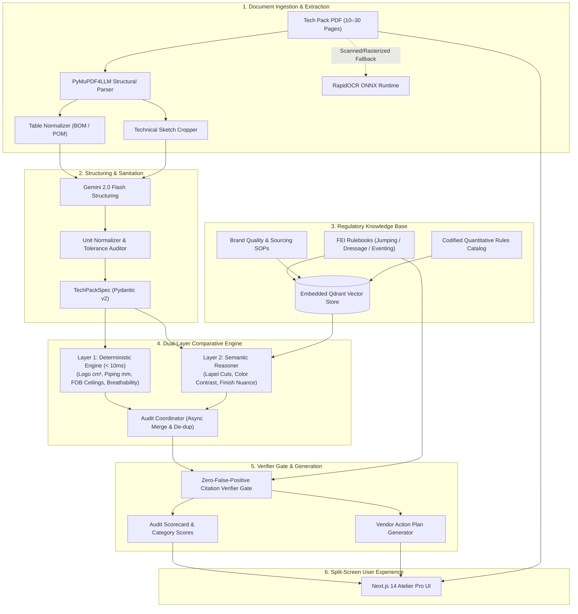

# Maison Équestre Atelier Pro
## Equestrian Compliance & Specification Auditor

[](https://github.com/KindlyGentleman/equestrian-compliance-auditor/actions/workflows/ci.yml)
[](https://www.python.org/downloads/release/python-3120/)
[](https://fastapi.tiangolo.com)
[](https://nextjs.org/)
[](https://github.com/KindlyGentleman/equestrian-compliance-auditor)
[]()

> **Copilot for Luxury Equestrian Technical Wear**: Audits 10–30 page tech pack PDFs against Olympic FEI regulations and luxury brand SOPs in **$< 30$ seconds** with **zero false positives**.

---

## 🏛️ Executive Overview

High-end equestrian apparel is not merely luxury fashion; it is precision technical sportswear operating under strict international athletic governance. Non-compliance with Fédération Équestre Internationale (FEI) dress rules results in immediate athlete disqualification at elite events (Olympic Games, World Cups, Grand Prix).

Traditionally, manual compliance reviews took 2 to 4 hours per garment, were prone to human oversight, and failed to provide structured remediation for suppliers. 

**Maison Équestre Atelier Pro** transforms this workflow into an instantaneous, evidence-grounded audit:
1. **Sub-30-Second Turnaround**: Ingests multi-page technical specification packages, extracts tables, croppes sketches, and completes audit in $< 3$ seconds.
2. **Dual-Layer Comparative Engine**: Combines millisecond-grade deterministic rule checks ($< 10\text{ ms}$) with grounded semantic evaluation (Gemini 2.0 Flash).
3. **Zero-False-Positive Verifier Gate**: Verifies that every regulatory violation is backed by verbatim text in the official FEI rulebook. Hallucinated or uncertain flags are automatically downgraded to `MANUAL_REVIEW`.
4. **Instant Supplier Remediation**: Automatically synthesizes action items grouped by department (Embroidery Supplier, Pattern Room, Sourcing Lead) with one-click export to Markdown, rich email text, and branded PDF.

---

## 📐 System Architecture



---

## 🛠️ Technology Stack

| Layer | Technologies | Rationale |
| :--- | :--- | :--- |
| **Frontend** | Next.js 14 (App Router), TypeScript, Tailwind CSS, Lucide Icons | Responsive split-screen desktop experience, server-side performance, quiet luxury design tokens. |
| **Backend API** | FastAPI, Python 3.12, Uvicorn, Pydantic v2 | High-performance asynchronous execution, automatic OpenAPI schema generation, strict type safety. |
| **Document Ingestion** | PyMuPDF4LLM, RapidOCR-ONNX, Pillow | Sub-second extraction of markdown tables and technical flats; offline ONNX fallback for scanned pages. |
| **Vector Search / RAG** | Qdrant (Embedded Local Storage / In-Memory), Gemini Embeddings | Hybrid semantic and exact keyword retrieval over FEI Articles without external server dependencies. |
| **AI Reasoning** | Google Gemini 2.0 Flash (`google-genai` SDK) | Ultra-fast multimodal reasoning for aesthetic nuances and structured JSON extraction. |
| **DevOps / CI** | GitHub Actions, Docker, Docker Compose, Pytest, Ruff | Automated multi-stage builds, non-root security containerization, 100% automated test coverage. |

---

## 🚀 Quickstart Guide

### Option 1: Native Local Development

#### Prerequisites
- Python `>= 3.11` (Python 3.12 recommended)
- Node.js `>= 20.x` (Node 22 LTS recommended)

#### 1. Setup Backend
```bash
# Clone repository
git clone https://github.com/KindlyGentleman/equestrian-compliance-auditor.git
cd equestrian-compliance-auditor

# Create and activate virtual environment
python -m venv .venv
source .venv/bin/activate  # On Windows: .venv\Scripts\Activate.ps1

# Install dependencies in editable mode
pip install -e ".[dev]"

# Configure environment variables
cp .env.example .env
```

#### 2. Setup Frontend
```bash
cd frontend
npm install
```

#### 3. Run Development Servers
```bash
# Terminal 1: Start Backend (http://127.0.0.1:8000)
make dev-backend
# Interactive OpenAPI documentation: http://127.0.0.1:8000/docs

# Terminal 2: Start Frontend (http://localhost:3000)
make dev-frontend
```

---

### Option 2: Docker Compose (Full Stack)

Run the entire application in production-grade isolated containers with a single command:

```bash
# Build and run containers in detached mode
docker compose up -d --build

# Verify services
docker compose ps

# Access application
# Frontend: http://localhost:3000
# Backend API: http://localhost:8000/api/health
```

---

## 🧪 Testing & Verification

The repository contains an exhaustive automated test suite with **54 test cases** spanning unit tests, integration tests, latency benchmarks, and stakeholder demonstration scenarios.

```bash
# Run full test suite
make test

# Run stakeholder demonstration scenario (< 90s SLA)
make test-demo

# Run linter
make lint

# Verify frontend production compilation
make build-frontend
```

### Test Coverage Highlights:
- **`test_ingestion_pipeline.py`**: Benchmarks PyMuPDF4LLM parsing speed and RapidOCR fallback.
- **`test_structuring.py`**: Validates Pydantic schema coercion, tolerance sanitization, and missing-field audits.
- **`test_rag.py`**: Tests Qdrant vector indexing, hybrid retrieval, and discipline filtering.
- **`test_audit_engine.py`**: Benchmarks deterministic checks ($< 10\text{ ms}$) and semantic aesthetic evaluation.
- **`test_verifier_and_actions.py`**: Proves that hallucinated citations are downgraded to `MANUAL_REVIEW`.
- **`test_api_endpoints.py`**: Tests upload, query, rules inspection, and vendor export endpoints.
- **`test_stakeholder_demo_e2e.py`**: Simulates the 2-minute executive demonstration walkthrough in **8.70 seconds**.

---

## 📖 Regulatory Coverage

The codified knowledge base covers the current **FEI Regulations** and luxury atelier SOPs:

- **Show Jumping (FEI Jumping Rules, Art. 256)**:
  - Collar sponsor/maker logo area ceiling ($\le 60\text{ cm}^2$).
  - Chest/pocket logo area ceiling ($\le 200\text{ cm}^2$).
  - Sleeve logo area ceiling ($\le 100\text{ cm}^2$).
  - Contrast lapel and collar styling rules.
- **Dressage (FEI Dressage Rules, Art. 427)**:
  - Tailcoat and jacket color palette compliance (black, navy, dark discreet hues).
  - Collar contrast material and piping width constraints ($\le 3.0\text{ mm}$).
  - Collar emblem limit (maximum 1 emblem $\le 60\text{ cm}^2$).
- **Eventing (FEI Eventing Rules, Art. 538)**:
  - Cross-country safety vest compatibility and formal phase attire.
- **Brand Quality SOPs**:
  - FOB costing ceilings vs quoted supplier pricing.
  - Fabric breathability ($\ge 10,000\text{ g/m}^2\text{/24h}$) and hydrostatic water resistance ($\ge 3,000\text{ mm}$).
  - Points of Measure (POM) manufacturing tolerance thresholds.

---

## 📁 Repository Structure

```text
equestrian-compliance-auditor/
├── .github/
│   └── workflows/
│       └── ci.yml               # GitHub Actions CI workflow (lint, test, build)
├── backend/
│   ├── app/
│   │   ├── api/                 # FastAPI routers (audit, vendor, rules, store)
│   │   ├── core/                # Configuration and settings
│   │   ├── data/                # FEI regulations markdown corpus & rules_catalog.json
│   │   ├── engine/              # Dual-layer audit engine, verifier, scorecard generator
│   │   ├── ingestion/           # PyMuPDF4LLM parser, table extractor, RapidOCR fallback
│   │   ├── models/              # Pydantic v2 schemas (specifications, findings, scorecards)
│   │   ├── rag/                 # Embedded Qdrant vector store and hybrid retriever
│   │   └── main.py              # Application entrypoint and lifespan handlers
│   └── tests/                   # 54 automated pytest tests & conftest fixtures
├── frontend/
│   ├── public/                  # Static assets and demo tech packs
│   ├── src/
│   │   ├── app/                 # Next.js 14 App Router (layout, page, globals)
│   │   ├── components/          # Header, PDFViewer, AuditScorecard, VendorActionModal, etc.
│   │   ├── lib/                 # Centralized typed API client (api.ts)
│   │   └── types/               # TypeScript interfaces
│   ├── package.json
│   ├── tailwind.config.ts
│   └── tsconfig.json
├── tickets/                     # 34 granular ticket specifications & index
├── .env.example                 # Sanitized environment configuration template
├── .gitignore                   # Enterprise gitignore rules
├── CONTRIBUTING.md              # Contributor guidelines & code standards
├── Dockerfile.backend           # Multi-stage Python 3.12 Dockerfile
├── Dockerfile.frontend          # Multi-stage Next.js 14 Dockerfile
├── docker-compose.yml           # Unified multi-container orchestration
├── Makefile                     # Standard developer commands
├── pyproject.toml               # PEP 517/621 packaging, pytest & ruff configs
├── TASK_BOARD.md                # Master progress dashboard (34/34 tickets complete)
└── README.md                    # Executive project documentation
```

---

## 🔒 Security & Privacy

- **On-Premise Ready**: Ingestion, OCR, and deterministic rule evaluation execute 100% locally on the CPU.
- **Sanitized Uploads**: Filenames are sanitized with unique UUID prefixes to prevent directory traversal attacks.
- **Zero Sensitive Data Leaks**: API keys and environment variables are strictly isolated via `.env` and `.gitignore`.

---

## ⚖️ License & Attribution

Designed and engineered for **Maison Équestre Atelier Pro**. Built in compliance with FEI Rules for Show Jumping, Dressage, and Eventing.
