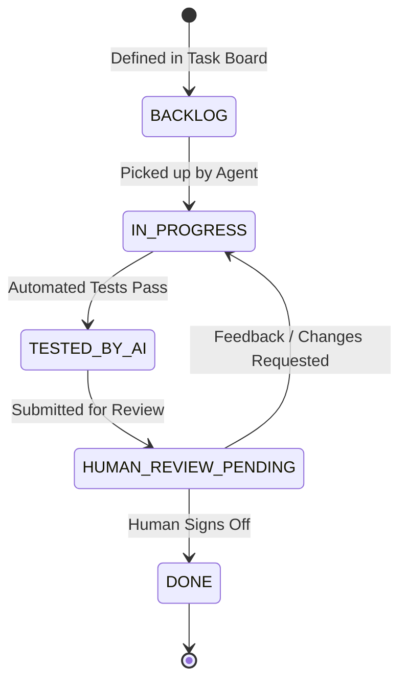

# TASK_BOARD: Equestrian Compliance & Specification Auditor
## Project Master Ticketing & Verification Tracker

> **Status Legend:**
> - `[BACKLOG]` - Defined, ready to be picked up
> - `[IN_PROGRESS]` - Currently being implemented by AI Agent
> - `[TESTED_BY_AI]` - Automated unit/integration tests executed and passed by AI
> - `[HUMAN_REVIEW_PENDING]` - Ready for user verification and sign-off
> - `[DONE]` - Verified and approved by Human Reviewer

---

## 📊 Stage Overview & Progress Dashboard

| Stage | Name | Total Tickets | Backlog | In Progress | Tested by AI | Human Review | Done | Status |
| :--- | :--- | :---: | :---: | :---: | :---: | :---: | :---: | :---: |
| **Stage 1** | Environment Setup & Scaffolding | 3 | 0 | 0 | 3 | 0 | 0 | `[TESTED_BY_AI]` |
| **Stage 2** | SOTA Ingestion & OCR Pipeline | 5 | 0 | 0 | 5 | 0 | 0 | `[TESTED_BY_AI]` |
| **Stage 3** | Pydantic Schema & Structuring | 4 | 0 | 0 | 4 | 0 | 0 | `[TESTED_BY_AI]` |
| **Stage 4** | Regulatory Knowledge Base & RAG | 5 | 5 | 0 | 0 | 0 | 0 | `[BACKLOG]` |
| **Stage 5** | Dual-Layer Comparative Audit Engine | 3 | 3 | 0 | 0 | 0 | 0 | `[BACKLOG]` |
| **Stage 6** | Verifier Gate & Vendor Action Generator | 4 | 4 | 0 | 0 | 0 | 0 | `[BACKLOG]` |
| **Stage 7** | FastAPI Backend & Endpoints | 5 | 5 | 0 | 0 | 0 | 0 | `[BACKLOG]` |
| **Stage 8** | Next.js Luxury UI & Split-Screen | 5 | 5 | 0 | 0 | 0 | 0 | `[BACKLOG]` |
| **Total** | **All Stages** | **34** | **22** | **0** | **12** | **0** | **0** | `35% Tested by AI` |

---

## 📋 Granular Tickets Directory

### STAGE 1: Environment Setup, Scaffolding & Configuration
- [x] [TICK-0101](file:///d:/03_Proyek/RAG%20Testing/tickets/TICK-0101-project-scaffolding.md) — Project repository structure, virtualenv & dependency management `[TESTED_BY_AI]`
- [x] [TICK-0102](file:///d:/03_Proyek/RAG%20Testing/tickets/TICK-0102-core-dependencies.md) — Core libraries installation (`pymupdf4llm`, `rapidocr-onnxruntime`, `pydantic`, `qdrant-client`, `google-genai`, `fastapi`) `[TESTED_BY_AI]`
- [x] [TICK-0103](file:///d:/03_Proyek/RAG%20Testing/tickets/TICK-0103-config-and-secrets.md) — Configuration manager, environment variables (`.env.example`), and Gemini API client setup `[TESTED_BY_AI]`

### STAGE 2: SOTA Document Ingestion & Image Cropping Pipeline (FR-1)
- [x] [TICK-0201](file:///d:/03_Proyek/RAG%20Testing/tickets/TICK-0201-pdf-parser-core.md) — `PyMuPDF4LLM` text and structural document parser with page tracking `[TESTED_BY_AI]`
- [x] [TICK-0202](file:///d:/03_Proyek/RAG%20Testing/tickets/TICK-0202-table-markdown-extractor.md) — Tabular data extraction & markdown table normalizer (BOM, measurement charts) `[TESTED_BY_AI]`
- [x] [TICK-0203](file:///d:/03_Proyek/RAG%20Testing/tickets/TICK-0203-sketch-image-cropper.md) — Technical flat sketch and logo artwork cropper with coordinate caching `[TESTED_BY_AI]`
- [x] [TICK-0204](file:///d:/03_Proyek/RAG%20Testing/tickets/TICK-0204-rapidocr-fallback.md) — `RapidOCR-ONNX` CPU fallback parser for rasterized/scanned tech pack pages `[TESTED_BY_AI]`
- [x] [TICK-0205](file:///d:/03_Proyek/RAG%20Testing/tickets/TICK-0205-ingestion-benchmark.md) — Ingestion pipeline integration test & speed benchmark (< 3s latency budget) `[TESTED_BY_AI]`

### STAGE 3: Pydantic Schema Structuring & Modeling (FR-2)
- [x] [TICK-0301](file:///d:/03_Proyek/RAG%20Testing/tickets/TICK-0301-pydantic-schemas.md) — Comprehensive Pydantic v2 schemas (`FabricSpec`, `BOMComponent`, `MeasurementTolerances`, `BrandingLogoSpec`, `CostingSpec`) `[TESTED_BY_AI]`
- [x] [TICK-0302](file:///d:/03_Proyek/RAG%20Testing/tickets/TICK-0302-gemini-structuring-engine.md) — Gemini 2.0 Flash structured JSON extraction engine using native `response_schema` `[TESTED_BY_AI]`
- [x] [TICK-0303](file:///d:/03_Proyek/RAG%20Testing/tickets/TICK-0303-missing-data-sanitizer.md) — Incomplete spec handler, unit normalizer (inches to cm, oz to gsm), and schema validator `[TESTED_BY_AI]`
- [x] [TICK-0304](file:///d:/03_Proyek/RAG%20Testing/tickets/TICK-0304-extraction-validation-suite.md) — Automated test suite for structured extraction across sample tech packs `[TESTED_BY_AI]`

### STAGE 4: Regulatory Knowledge Base & Hybrid RAG (FR-3)
- [ ] [TICK-0401](file:///d:/03_Proyek/RAG%20Testing/tickets/TICK-0401-fei-corpus-curation.md) — FEI Rulebook ingestion & chunking (Show Jumping Art 256, Dressage Art 427, Eventing Art 538, Logo Guidelines) `[BACKLOG]`
- [ ] [TICK-0402](file:///d:/03_Proyek/RAG%20Testing/tickets/TICK-0402-brand-sop-corpus.md) — Luxury Brand Quality SOP corpus creation (target FOB/COGS, fabric breathability min, seam strength, color codes) `[BACKLOG]`
- [ ] [TICK-0403](file:///d:/03_Proyek/RAG%20Testing/tickets/TICK-0403-structured-rule-catalog.md) — Pre-compiled structured quantitative rule catalog (`rules_catalog.json` for deterministic checks) `[BACKLOG]`
- [ ] [TICK-0404](file:///d:/03_Proyek/RAG%20Testing/tickets/TICK-0404-qdrant-hybrid-store.md) — Qdrant vector store initialization with hybrid search (dense embeddings + BM25/payload filters) `[BACKLOG]`
- [ ] [TICK-0405](file:///d:/03_Proyek/RAG%20Testing/tickets/TICK-0405-hybrid-retrieval-engine.md) — Hybrid retrieval engine with discipline and garment category filtering `[BACKLOG]`

### STAGE 5: Dual-Layer Comparative Audit Engine (FR-4)
- [ ] [TICK-0501](file:///d:/03_Proyek/RAG%20Testing/tickets/TICK-0501-layer1-deterministic-engine.md) — Layer 1 Deterministic Audit Engine (Python code-level evaluator for logo cm², tolerances, COGS, breathability) `[BACKLOG]`
- [ ] [TICK-0502](file:///d:/03_Proyek/RAG%20Testing/tickets/TICK-0502-layer2-semantic-reasoner.md) — Layer 2 Semantic Reasoner (Gemini 2.0 Flash prompt evaluating aesthetic rules, collar contrast, piping, lapels) `[BACKLOG]`
- [ ] [TICK-0503](file:///d:/03_Proyek/RAG%20Testing/tickets/TICK-0503-audit-engine-coordinator.md) — Audit Engine Coordinator (orchestrating Layer 1 and Layer 2 outputs into unified findings) `[BACKLOG]`

### STAGE 6: Zero-False-Positive Verifier Gate & Vendor Action Generator (FR-5 & FR-6)
- [ ] [TICK-0601](file:///d:/03_Proyek/RAG%20Testing/tickets/TICK-0601-citation-verifier-gate.md) — Automated Verbatim Citation Verifier Gate (validating that semantic citations exist verbatim in source text, auto-downgrading unverified flags to `MANUAL_REVIEW`) `[BACKLOG]`
- [ ] [TICK-0602](file:///d:/03_Proyek/RAG%20Testing/tickets/TICK-0602-audit-scorecard-generator.md) — Audit Scorecard generator with visual status indicators (PASS / WARNING / VIOLATION / MANUAL_REVIEW) `[BACKLOG]`
- [ ] [TICK-0603](file:///d:/03_Proyek/RAG%20Testing/tickets/TICK-0603-vendor-action-generator.md) — Automated Vendor Action Generator synthesizing supplier revision notes with exact remediation instructions `[BACKLOG]`
- [ ] [TICK-0604](file:///d:/03_Proyek/RAG%20Testing/tickets/TICK-0604-end-to-end-audit-benchmark.md) — End-to-end benchmark test (< 30s latency, 100% ground-truth accuracy, zero false positives) `[BACKLOG]`

### STAGE 7: FastAPI Backend & API Integration
- [ ] [TICK-0701](file:///d:/03_Proyek/RAG%20Testing/tickets/TICK-0701-fastapi-scaffolding.md) — FastAPI application setup, CORS, lifespan handlers, and structured error middleware `[BACKLOG]`
- [ ] [TICK-0702](file:///d:/03_Proyek/RAG%20Testing/tickets/TICK-0702-upload-audit-endpoint.md) — Tech pack upload and async audit execution endpoint (`POST /api/audit/upload`) `[BACKLOG]`
- [ ] [TICK-0703](file:///d:/03_Proyek/RAG%20Testing/tickets/TICK-0703-scorecard-query-endpoints.md) — Scorecard retrieval and history endpoints (`GET /api/audit/{id}`, `GET /api/audit/history`) `[BACKLOG]`
- [ ] [TICK-0704](file:///d:/03_Proyek/RAG%20Testing/tickets/TICK-0704-vendor-export-endpoints.md) — Vendor revision notes export endpoint (`POST /api/audit/{id}/export-vendor-notes` for markdown/PDF/email) `[BACKLOG]`
- [ ] [TICK-0705](file:///d:/03_Proyek/RAG%20Testing/tickets/TICK-0705-rules-management-endpoints.md) — Regulatory catalog and brand SOP inspection endpoints (`GET /api/rules`) `[BACKLOG]`

### STAGE 8: Next.js Luxury UI & Split-Screen Experience
- [ ] [TICK-0801](file:///d:/03_Proyek/RAG%20Testing/tickets/TICK-0801-nextjs-luxury-scaffolding.md) — Next.js 14 App Router project setup with Luxury equestrian minimalist theme (dark/light, refined typography) `[BACKLOG]`
- [ ] [TICK-0802](file:///d:/03_Proyek/RAG%20Testing/tickets/TICK-0802-split-screen-pdf-viewer.md) — Side-by-side interactive PDF viewer with page jump and region highlighting `[BACKLOG]`
- [ ] [TICK-0803](file:///d:/03_Proyek/RAG%20Testing/tickets/TICK-0803-interactive-scorecard-ui.md) — Interactive Audit Scorecard component with Pass/Warning/Violation badges and collapsible citations `[BACKLOG]`
- [ ] [TICK-0804](file:///d:/03_Proyek/RAG%20Testing/tickets/TICK-0804-vendor-action-modal-ui.md) — Vendor Action Note preview, inline editor, and one-click copy/download modal `[BACKLOG]`
- [ ] [TICK-0805](file:///d:/03_Proyek/RAG%20Testing/tickets/TICK-0805-end-to-end-stakeholder-demo.md) — Stakeholder demo verification test (under 2-minute executive walkthrough readiness) `[BACKLOG]`

---

## 🔄 Ticket State Machine & Review Protocol

Every ticket transitions through this lifecycle:

