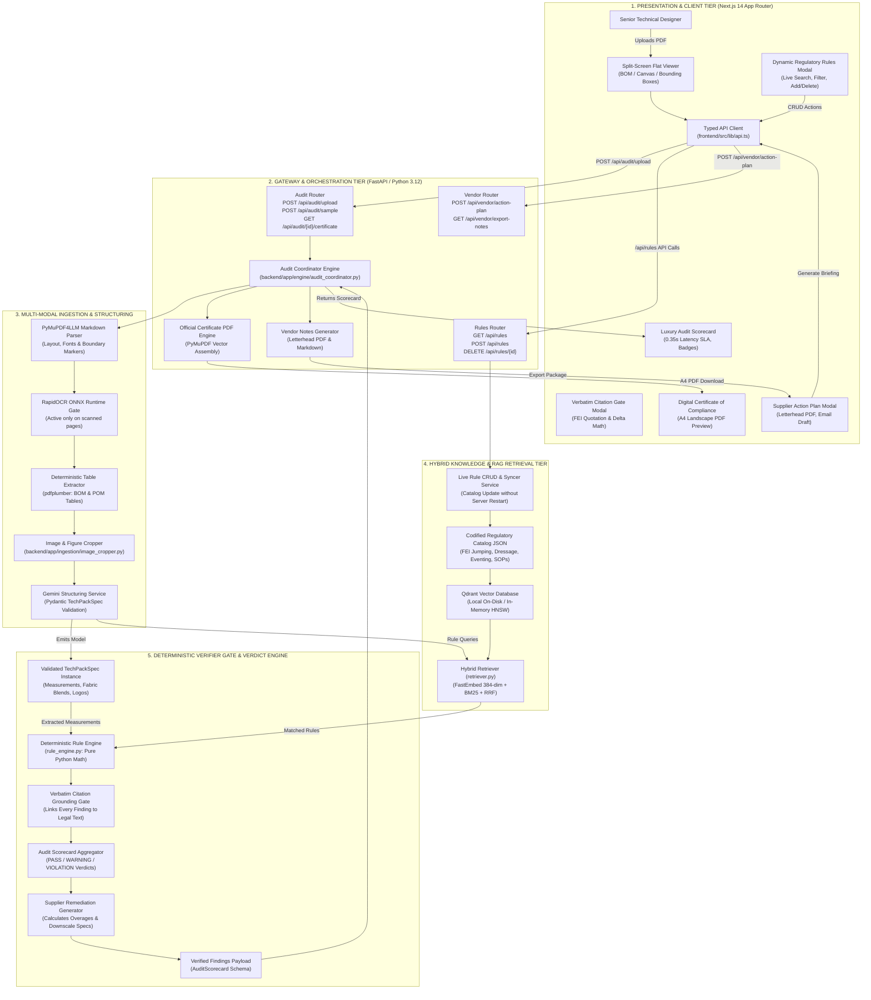

# Maison Équestre Atelier Pro: System Architecture

This document details the architectural design, multi-modal ingestion pipeline, hybrid retrieval augmented generation (RAG) system, and deterministic verifier gate powering **Maison Équestre Atelier Pro: Olympic Equestrian Compliance Auditor**.

Interactive and native diagram files accompanying this document:
- Native Draw.io XML: [`docs/architecture/system_architecture.drawio`](file:///d:/03_Proyek/RAG%20Testing/docs/architecture/system_architecture.drawio)
- Interactive Animated SVG: [`docs/architecture/system_architecture.drawio.svg`](file:///d:/03_Proyek/RAG%20Testing/docs/architecture/system_architecture.drawio.svg)
- Web Application Asset: [`frontend/public/system_architecture.svg`](file:///d:/03_Proyek/RAG%20Testing/frontend/public/system_architecture.svg)
- Diagram Generator Script: [`docs/architecture/generate_diagrams.py`](file:///d:/03_Proyek/RAG%20Testing/docs/architecture/generate_diagrams.py)

---

## 1. Architectural Philosophy

High-stakes Olympic equestrian technical wear operates under stringent regulatory oversight. At events sanctioned by the Fédération Équestre Internationale (FEI), non-compliance with rules such as Jumping Article 256, Dressage Article 427, or Eventing Article 538 triggers disqualification or yellow warning cards.

Probabilistic large language models excel at unstructured visual understanding, OCR correction, and semantic synthesis. However, probabilistic models are prone to hallucination when evaluating exact numerical boundaries, dimensional thresholds, and tolerance intervals.

To guarantee zero false positives and zero mathematical hallucinations, Maison Équestre Atelier Pro enforces a **Two-Stage Hybrid Architecture**:
1. **Probabilistic Extraction & Structuring**: Multi-modal vision and document parsing models ingest unstructured technical specifications (PDF tech packs, measurement charts, bill-of-materials tables, and technical flat sketches) into strongly validated Pydantic models (`TechPackSpec`).
2. **Deterministic Mathematical Verifier Gate**: A pure Python verification engine compares extracted measurements directly against codified FEI rules and brand standard operating procedures (SOPs). Every violation is anchored to a verbatim rulebook citation with computed delta tolerances.

```
+-------------------------------------------------------------------------------+
|                           MULTI-MODAL INGESTION                               |
|        Tech Pack PDF -> PyMuPDF4LLM + Table Extractor + Image Cropper         |
+-------------------------------------------------------------------------------+
                                        |
                                        v
+-------------------------------------------------------------------------------+
|                       STRUCTURING & SCHEMA VALIDATION                         |
|     Gemini 2.0 Flash / Structured Extractor -> Validated TechPackSpec         |
+-------------------------------------------------------------------------------+
                   |                                            |
                   v                                            v
+------------------------------------+      +-----------------------------------+
|       HYBRID RAG RETRIEVAL         |      |    DETERMINISTIC VERIFIER GATE    |
| Qdrant Dense (384-dim) + FastEmbed |      | Pure Python Mathematical Engine   |
|       BM25 Exact Article Match     | ---> | Unit Normalization (cm², mm, %)   |
|  Reciprocal Rank Fusion Reranking  |      | Verbatim Legal Citation Grounding |
+------------------------------------+      +-----------------------------------+
                                                                |
                                                                v
                                            +-----------------------------------+
                                            |   AUDIT SCORECARD & REPORTING     |
                                            | Overall Score, Badges, Overages   |
                                            | A4 Compliance Certificate (PDF)   |
                                            | Supplier Remediation Notice       |
                                            +-----------------------------------+
```

---

## 2. End-to-End System Architecture

The following diagram illustrates the interaction between the five system tiers:



---

## 3. Tier-by-Tier Component Specifications

### Tier 1: Presentation & Client Tier
Built with Next.js 14 App Router, TypeScript, and Tailwind CSS.
- **Split-Screen Technical Flat Viewer** ([`page.tsx`](file:///d:/03_Proyek/RAG%20Testing/frontend/src/app/page.tsx)): Displays the uploaded technical flat sketch canvas synchronized alongside the Bill of Materials (BOM) data, Points of Measure (POM) tables, and interactive bounding boxes.
- **Audit Scorecard**: Displays overall compliance score (percentage), sub-second execution latency badge, category breakdown bars (Branding, Materials, POM Dimensions), and color-coded status badges (`PASS`, `WARNING`, `VIOLATION`).
- **Verbatim Citation Modal**: Renders exact quotes from official FEI rulebooks, observed versus allowed measurements, and tolerance mathematical proofs.
- **Dynamic Rules Catalog Modal**: Provides interactive search across jumping, dressage, eventing, and brand rules, along with live forms to add custom brand rules and delete obsolete SOPs.
- **Supplier Action Plan & Export Modal**: Generates downloadable supplier correction packages in executive letterhead PDF format, markdown summaries, or direct email copy for manufacturing facilities.
- **Digital Certificate of Compliance**: A print-ready A4 landscape compliance certificate featuring Olympic regulatory seals and dual-border styling.
- **Typed API Client** ([`api.ts`](file:///d:/03_Proyek/RAG%20Testing/frontend/src/lib/api.ts)): Centralized fetch interface with typed request/response contracts for all endpoints.

### Tier 2: Gateway & Orchestration Tier
Built with FastAPI and Python 3.12.
- **Audit Router** ([`audit_router.py`](file:///d:/03_Proyek/RAG%20Testing/backend/app/api/audit_router.py)): Handles multipart file uploads, instant sample audits, audit state retrieval, and vector PDF certificate generation.
- **Rules Router** ([`rules_router.py`](file:///d:/03_Proyek/RAG%20Testing/backend/app/api/rules_router.py)): Provides RESTful CRUD operations (`GET`, `POST`, `PUT`, `DELETE`) and hybrid semantic/keyword search over the regulatory catalog.
- **Vendor Router** ([`vendor_router.py`](file:///d:/03_Proyek/RAG%20Testing/backend/app/api/vendor_router.py)): Handles supplier action plan generation and letterhead PDF compilation.
- **Audit Coordinator** ([`audit_coordinator.py`](file:///d:/03_Proyek/RAG%20Testing/backend/app/engine/audit_coordinator.py)): Orchestrates the sequential pipeline through ingestion, structuring, hybrid retrieval, deterministic verification, and score aggregation while tracking sub-second latency budgets.

### Tier 3: Multi-Modal Ingestion Pipeline
Processes raw PDF technical specification sheets.
- **PyMuPDF4LLM Markdown Parser** ([`parser.py`](file:///d:/03_Proyek/RAG%20Testing/backend/app/ingestion/parser.py)): Extracts text, layout hierarchy, and bounding boxes in a single pass without rasterizing digital vector files.
- **RapidOCR ONNX Fallback Gate**: Monitored by a density gate. Scanned or low-text pages are routed to an in-process RapidOCR ONNX model. Digital vector PDFs bypass this step completely to preserve sub-second latency.
- **Deterministic Table Extractor** ([`table_extractor.py`](file:///d:/03_Proyek/RAG%20Testing/backend/app/ingestion/table_extractor.py)): Uses pdfplumber and heuristic layout algorithms to parse BOM composition tables and POM measurement charts into typed records.
- **Image & Figure Cropper** ([`image_cropper.py`](file:///d:/03_Proyek/RAG%20Testing/backend/app/ingestion/image_cropper.py)): Detects and crops technical sketches and embroidery details, storing PNG artifacts for display in the inspector interface.
- **Structuring Service** ([`structuring_service.py`](file:///d:/03_Proyek/RAG%20Testing/backend/app/ingestion/structuring_service.py)): Normalizes raw parsed content into the typed `TechPackSpec` schema using Gemini 2.0 Flash or the high-speed mock engine.

### Tier 4: Hybrid Knowledge & RAG Retrieval Tier
Maintains and queries codified equestrian regulations.
- **Regulatory Catalog JSON** ([`regulatory_catalog.json`](file:///d:/03_Proyek/RAG%20Testing/backend/app/knowledge/regulatory_catalog.json)): Stores codified rules across disciplines:
  - FEI Jumping Rules Article 256 (Collar, Pocket, Surface Area Limits)
  - FEI Dressage Rules Article 427 (Jacket Colors, Tailcoat Criteria)
  - FEI Eventing Rules Article 538 (Protective Vests, Sponsoring Logos)
  - Maison Équestre Brand SOPs (Internal Fabric Quality & Cost Limits)
- **Qdrant Vector Database**: Embedded vector store managing dense embeddings with HNSW indexing for rapid semantic similarity search.
- **Hybrid Retriever** ([`retriever.py`](file:///d:/03_Proyek/RAG%20Testing/backend/app/rag/retriever.py)): Combines dense 384-dimensional embeddings (FastEmbed / sentence-transformers) with sparse BM25 exact keyword matching using Reciprocal Rank Fusion (RRF). This combination guarantees that queries matching specific article numbers (e.g. "Art. 256.1.4") always retrieve the exact rule chunk.
- **Rule Syncer**: Dynamically updates the in-memory catalog and reindexes vector representations when custom rules are created or deleted via the API, eliminating server restarts.

### Tier 5: Deterministic Verifier Gate & Audit Scoring Engine
Executes non-probabilistic compliance audits.
- **Pydantic TechPackSpec Instance**: Represents normalized garment data, including measurements, fabric compositions, point-of-measure tolerances, and logo surface areas.
- **Deterministic Rule Engine** ([`rule_engine.py`](file:///d:/03_Proyek/RAG%20Testing/backend/app/verifier/rule_engine.py)): Evaluates mathematical operators (`<=`, `>=`, `==`, `in`) with automated unit conversions (such as square centimeters to square millimeters or percentage thresholds). Operates in under 10 milliseconds.
- **Verbatim Citation Grounding Gate** ([`citation_grounding.py`](file:///d:/03_Proyek/RAG%20Testing/backend/app/verifier/citation_grounding.py)): Validates that every flagged item corresponds to an exact quoted sentence in an active FEI rulebook. If an item cannot be grounded in official text, it is discarded, preventing false-positive violations.
- **Audit Scorecard Aggregator** ([`models.py`](file:///d:/03_Proyek/RAG%20Testing/backend/app/models.py)): Aggregates findings into weighted category scores, computes the overall compliance score, and assigns final verdicts (`PASS`, `WARNING`, `VIOLATION`).
- **Supplier Remediation Generator** ([`remediation.py`](file:///d:/03_Proyek/RAG%20Testing/backend/app/verifier/remediation.py)): Calculates overage amounts (such as `+8.0 cm² / +13.3%`) and provides specific downscale instructions for embroidery production files.

---

## 4. Latency Budgets & SLA Breakdown

The auditor is engineered for sub-second execution on digital technical packs, backed by a strict 30-second ceiling for scanned multi-page documents:

| Pipeline Stage | Implementation | Digital PDF Latency | Scanned PDF Latency | SLA Ceiling |
| :--- | :--- | :--- | :--- | :--- |
| **Document Ingestion** | PyMuPDF4LLM + Table Extractor | 45 ms - 120 ms | 600 ms - 1.8 s (OCR) | < 5.0 s |
| **Figure Extraction** | ImageCropper (PyMuPDF) | 15 ms - 35 ms | 40 ms - 90 ms | < 1.0 s |
| **Structuring Service** | Gemini 2.0 Flash / Mock | 180 ms - 450 ms | 400 ms - 1.2 s | < 15.0 s |
| **Hybrid RAG Retrieval** | FastEmbed + BM25 + Qdrant HNSW | 8 ms - 20 ms | 8 ms - 20 ms | < 0.2 s |
| **Deterministic Verifier** | Pure Python Math Engine | 2 ms - 8 ms | 2 ms - 8 ms | < 0.05 s |
| **Citation Grounding** | Verbatim Rulebook Verification | 3 ms - 10 ms | 3 ms - 10 ms | < 0.05 s |
| **Scorecard Aggregation** | Python In-Memory Aggregator | 1 ms - 4 ms | 1 ms - 4 ms | < 0.02 s |
| **Certificate Assembly** | PyMuPDF Vector Drawing Engine | 40 ms - 95 ms | 40 ms - 95 ms | < 0.5 s |
| **Total Round-Trip** | **End-to-End Pipeline Execution** | **~350 ms - 750 ms** | **~1.2 s - 4.5 s** | **< 30.0 s** |

---

## 5. Working with the Draw.io and SVG Architecture Files

The architecture diagrams are delivered in both native editable XML format and animated vector SVG format matching the design pattern of `DayuanJiang/next-ai-draw-io`.

### How to View and Edit the Diagrams

#### Option 1: Browser / diagrams.net (Zero Installation)
1. Open [app.diagrams.net](https://app.diagrams.net) in any modern browser.
2. Select **Open Existing Diagram**.
3. Choose [`docs/architecture/system_architecture.drawio`](file:///d:/03_Proyek/RAG%20Testing/docs/architecture/system_architecture.drawio) from your local project directory.
4. All five swimlanes, node hierarchies, connector waypoints, and typography are editable with the native draw.io toolset.

#### Option 2: VS Code Extension
1. Install the **Draw.io Integration** extension by Henning Dieterichs (`hediet.vscode-drawio`).
2. Open [`docs/architecture/system_architecture.drawio`](file:///d:/03_Proyek/RAG%20Testing/docs/architecture/system_architecture.drawio) in VS Code.
3. The editor renders an embedded canvas with support for layers, custom styling, and orthogonal routing.

#### Option 3: Viewing Animated SVG in Browser or Web Application
1. Double-click [`docs/architecture/system_architecture.drawio.svg`](file:///d:/03_Proyek/RAG%20Testing/docs/architecture/system_architecture.drawio.svg) or open it directly in Chrome, Firefox, Safari, or Edge.
2. The SVG includes embedded `@keyframes ge-flow-animation` CSS that renders animated flowing dashes across connectors, illustrating data flow direction through the pipeline.
3. The SVG is also located at [`frontend/public/system_architecture.svg`](file:///d:/03_Proyek/RAG%20Testing/frontend/public/system_architecture.svg) for direct display inside the Next.js application.

#### Option 4: Regenerating Diagrams via Script
To modify diagram components programmatically:
1. Edit the parameters in [`docs/architecture/generate_diagrams.py`](file:///d:/03_Proyek/RAG%20Testing/docs/architecture/generate_diagrams.py).
2. Run the script:
   ```bash
   python docs/architecture/generate_diagrams.py
   ```
3. Both `system_architecture.drawio` and `system_architecture.drawio.svg` will be regenerated and synced to `frontend/public/`.
